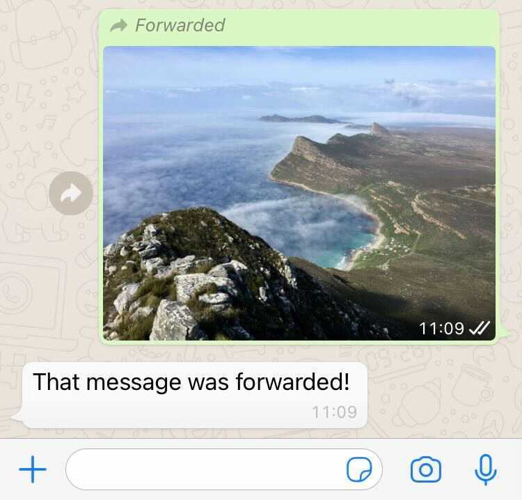

# turnio-forwarded-flags-replit

An example Turn.io webhook integration on Replit for replying to forwarded and frequently forwarded messages. If a message was forwarded the webhook will reply with a message confirming it.

*This Replit assumes the following*:

1. You have gone through the [webhooks example](https://github.com/turnhub/turnio-webhooks-replit) and are comfortable with how to get an authentication for Turn and set it up as a secret in Repl.it

# How to run this Repl.it

1. Click the `Run on Repl.it` button above and install this example into your Repl.it workspace.
2. Get a Turn token and add it as a secret called `TOKEN` in Repl.it
3. Set up the webhook in Turn using the URL generated for your workspace by Repl.it. 
5. Forward a message to your number and receive a reply indicating that it was forwarded.

